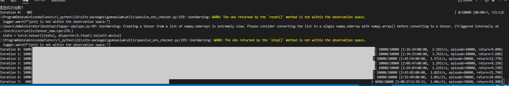

## 这是使用ppo算法+FalppyBird环境的强化学习实例。
更详细的介绍请看我的博客[博客链接](https://chenlidbk.xyz/2024/04/30/tiankeng6/)

## 基本资料
# 定义超参数和环境
```
actor_lr = 1e-6
critic_lr = 1e-5
num_episodes = 100000
hidden_dim = 64
gamma = 0.99
lmbda = 0.95
epochs = 10
eps = 0.2
device = torch.device("cuda") if torch.cuda.is_available() else torch.device("cpu")
env_name = 'FlappyBird-v0'
```
基本上一轮在GTX3080显卡上需要跑



## 怎么使用agent来玩falppy bird
1. 第一步，配置环境
```
pip install -r requirements.txt
```

2. 运行test.py文件 可以使用以下命令,
```
python test.py
```

3. 如果想自己训练模型，可以运行ppo.py文件
```
python ppo.py
```

